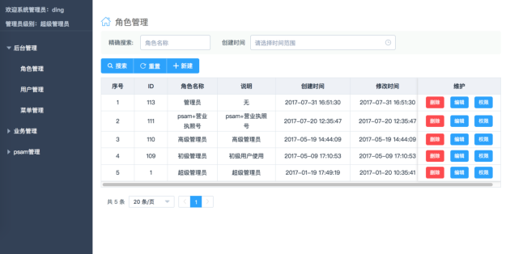
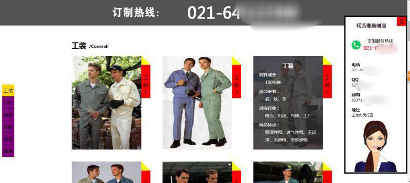
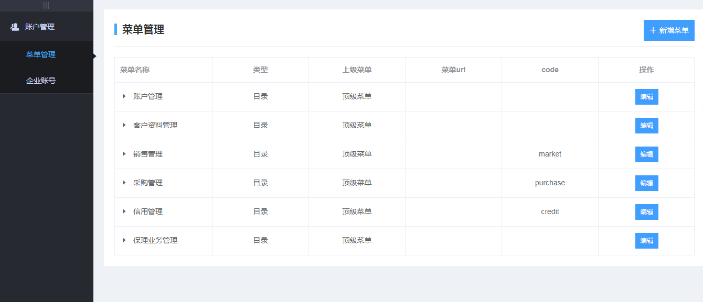
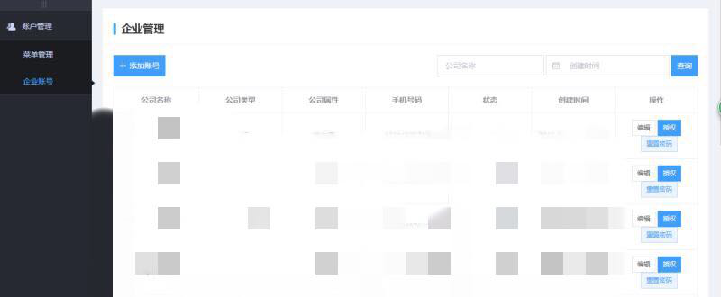

# 我的个人简历

姓    名：	丁文娟  | 女 | 25岁	 工作经验：三年以上  
联系邮箱：237620343@qq.com	 联系电话：13585782639  
期望职业：Web前端开发工程师	   工作地区：上海  
期望月薪：15K-18K	 目前状况：我目前处于离职状态，可立即上岗  
Github：  <a href="https://github.com/dwj8888">https://github.com/dwj8888</a>     
个人网站： <a href="http://www.dingwenjuan.cn/">http://www.dingwenjuan.cn/</a>   

专业技能

1、精通Div+Css页面布局。熟练使用Html5，Css3等新特性，制作响应式布局及其他各类布局。 
2、精通Vue.js前端主流框架，熟悉Angular.js，React.js，微信小程序等前端技术，熟练使用技术栈Elemen-ui、Vue-router、Vuex、Axios、Webpack。 
3、熟练使用JQuery、Zepto、Bootstrap、Swiper等第三方类库。 
4、熟悉使用JavaScript、AJAX、JSON、DOM、BOM。 
5、掌握Node.js等服务器语言，与后台开发工程师协作，能完成操作交互。 
6、熟悉使用Photoshop、Visual studio code 、Sublime、Hbuilder、Firebug等开发软件。 
7、有解决问题、钻研新技术的兴趣和能力，具有良好团队合作精神，有高度的责任心，能够胜任一定压力的工作。 

工作经验

2017/1 – 至今
上海赛康服饰有限公司|前端工程师 
行业类别：服装|企业性质：合资 
工作描述：  
1、使用Vue技术栈独自对后台管理系统进行开发。 
2、使用HTML、CSS3、JS独自构建公司网站实现界面效果。 
3、配合后台完成前后端交互。 
4、配合产品经理完成Web项目迭代，不断优化和提升用户体验。 
5、根据业务需求，维护前端组件，持续提升页面性能。 

2015/8 – 2017/1 
摩贝（上海）生物科技有限公司|前端工程师 
行业类别：B2B电商|企业性质：合资 
工作描述：  
1、使用Vue主流框架，维护前端框架的技术升级。 
2、负责Web前端系统和功能调试和维护。 
3、配合产品经理和UI设计师，研究并改善用户体验。 
4、实现前后端的数据交互。 

2014/12 -- 2015/8 
上海安师傅汽车服务股份有限公司|前端开发工程师 
行业类别： 互联网/电子商务|企业性质：合资 
工作描述：  
1、	使用Div+Css以及Html5+Css3等技术开发符合W3C标准的前端Pc页面及响应式页面。 
2、	使用Javascript 、Jquery、Ajax等技术完成页面美化交互和数据交互。 
3、	根据产品需求和平面设计，优化后期前端用户体现效果，提高用户体验。 
4、	Pc 端网页及移动端的维护、更新。 

项目经验

1、赛康服饰后台管理系统

 
项目介绍 ：上海赛康服饰后台管理系统主要针对业务需要构建，便于管理客户信息、商品库存、发票信息、采购信息、销售信息等业务平台! 

技术选型：vue2 + vuex + vue-router + webpack + ES6 + less + element-ui+ axios等 
实现技术：根据产品需求，使用element-ui框架对页面进行布局搭建，根据后台提供的API设置角色权限，根据不用的用户使用，vue-router进行页面跳转，用axios封装接口进行数据请求等。 

2、赛康服饰官网

 
项目介绍 ：上海赛康服饰直营各类中高档制服、工装。并在上海、华东、华北等各经济重点城市设有分公司和工厂。未来，上海赛康服饰将继续秉承“创新更高品质、服务眼见为实”的理念，为广大客户提供尽善尽美的服务！

技术选型：HTML5、CSS3、Javascript、jQuery、Ajax等
实现技术：使用Div+Css、Html5、Css3、等技术对页面进行布局搭建，使用Js、JQuery进行网页特效制作，使用Ajax技术对数据进行处理。
相关链接：<a href="http://www.skfushi.cn/">http://www.skfushi.cn/</a> 

3、摩贝SAAS平台

 
项目介绍 ：摩贝化学品综合信息管理平台汇聚了化学品全产业链的专业及商业数据，为全球化学品从业者提供一站式信息资讯服务。 

技术选型：vue2 + vuex + vue-router + webpack + ES6/7 + less + element-ui+ axios 
实现技术：根据产品需求，使用element-ui框架对页面进行布局搭建，使用vue-router进行页面跳转，用webpack进行编译，用axios封装接口进行数据请求等。 
相关链接： <a href="http://saas.molbase.cn">http://saas.molbase.cn</a> 

4、安师傅官网

项目介绍 ：安师傅不仅提供代驾服务以外，更涉及代维修、代保养、代年检、陪练车、接送家人、接送机等更加细致人性化的服务领域，也可提供为个人量身定做的“私人定制”服务。 

技术选型：HTML5、CSS3、Javascript、jQuery、Ajax等 
实现技术：根据产品需求，使用Div+Css、Html5、Css3、等技术对页面进行布局搭建，使用Js、JQuery进行网页特效制作，并配合后端使用Ajax技术对数据进行处理。 
相关链接：<a href="http://www.4001002003.com/">http://www.4001002003.com/</a> 

教育经历

2012/09 -- 2014/12 中央广播电视大学|本科|

自我评价

	能够耐心解决编写代码中遇到的问题，反复思考更优的编写代码技巧，以及网页优化方案。 
	对待工作勤奋，认真负责，适应高强度工作压力。 
	自学能力及自我解决问题能力强，拥有敏锐的洞察力，喜欢分析问题，能够不断自我审视。 
	善于与人沟通，能在短时间内融入陌生环境，具有团队合作精神。 

  致谢：感谢伱花时间阅读我的简历，希望能与你一起共事！

 

  
